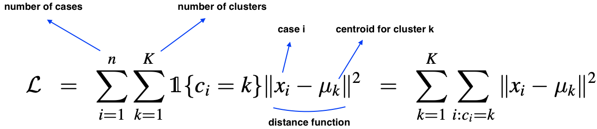

# Machine Learning

## Matrix Differentiation

* Defining what matrix differentiation is.
  * https://betterexplained.com/articles/vector-calculus-understanding-the-gradient/ 
* Refresher on linear algebra, drivatives and gradients.
  * https://atmos.washington.edu/~dennis/MatrixCalculus.pdf
* Khan tutorials on multivariable culculus. Jump straight to the Jacobian.  
  * https://www.khanacademy.org/math/multivariable-calculus/multivariable-derivatives
* Step by step solutions of gradients.
  * http://www.cs.huji.ac.il/~csip/tirgul3_derivatives.pdf
  
### Determinant
  * Tells us the size by which the [unit vectors](https://en.wikipedia.org/wiki/Unit_vector) will scale or decrease by i.e. be transformed by.
  * The determinant tells us the factor by which areas are stretch or shrunk by. 
    * great than one, then the area is growing.
    * less than one, then the area is shrinking.
```
   i j
  [1 0]
  [0 1]
```
```
  [3 1]
  [0 2]

^ has a derminant of 6 i.e. (3*2)-(1*0)
That means 

  [1 0]
  [0 1]

will grow 6 times it's size; the area will be 6 times the original size of the unit vectors.
```
 * If the determinant is zero, there is no inverse.

## Intergral Calculus

* Math for Machine Learning
  * http://users.umiacs.umd.edu/~hal/courses/2013S_ML/math4ml.pdf
* Calc 3 (good course to catch you up to speed with Calculus)
  * https://www.udemy.com/calculus-3
  * ^ derivatives, integrals, linear algebra (dot and cross products) differentials (Laplace)

## Kmeans
K-means is the simplest and most fundamental clustering algorithm.

Input: x<sub>1</sub>, . . . , x<sub>n</sub>, where x ∈ R<sup>d</sup>.

Treats each x as a vector in R<sup>d</sup>

Output: Vector c of cluster assignments, and K mean vectors µ.


 - c = (c<sub>1</sub>, . . . , c<sub>n</sub>), c<sub>i</sub> ∈ {1, . . . , K}
   - If c<sub>i</sub> = c<sub>j</sub> = k, then x<sub>i</sub> and x<sub>j</sub> are clustered together in cluster k.
   - c is an integer that represents each cluster.
 - µ = (µ<sub>1</sub>, . . . , µ<sub>K</sub>), µ<sub>k</sub> ∈ R<sup>d</sup> (same space as xi)
   - Each µ<sub>k</sub> (called a centroid) is a set of k d-dimensional vectors that's part of some c.
   - µ number of vectors for each cluster.
   - µ<sub>k</dub> defines the cluster for the k's cluster.
   
The K-means objective function can be written as


 <sub>source: https://www.saedsayad.com/clustering_kmeans.htm</sub>
#### Algorithm	
	
 1. Clusters the data into k groups where k  is predefined.
 2. Select k points at random as cluster centers.
 3. Assign objects to their closest cluster center according to the Euclidean distance function.
 4. Calculate the centroid or mean of all objects in each cluster.
 5. Repeat steps 2, 3 and 4 until the same points are assigned to each cluster in consecutive rounds.
 
 