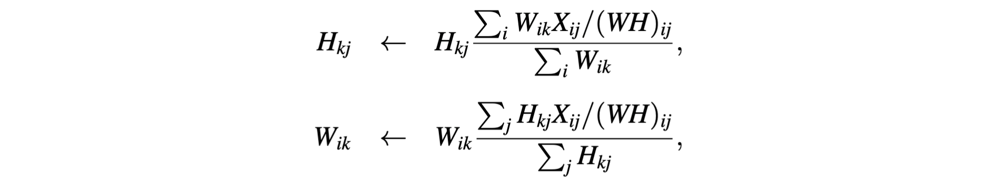

# Machine Learning

A mix of class notes, online resources and hw assignments from the Machine Learning class at Columbia.


# Table of Contents
  - [Online Resources](#online-resources)
    - [Matrix Differentiation](#matrix-differentiation)
    - [Determinant](#determinant)
    - [Intergral Calculus](#intergral-calculus)
  - [Unsupervised Models](#unsupervised-models)
    - [Kmeans](#kmeans)
      - [Algorithm](#algorithm)
      - [Coordinate Descent](#coordinate-descent)
    - [Maximum Likelihood using EM Algorithm](#maximum-likelihood-using-em-algorithm)
    - [Markov Chain](#markov-chain)
    - [Nonnegative Matrix Factorization](#nonnegative-matrix-factorization)
    
    
# Online Resources


## Matrix Differentiation

* Defining what matrix differentiation is.
  * https://betterexplained.com/articles/vector-calculus-understanding-the-gradient/ 
* Refresher on linear algebra, drivatives and gradients.
  * https://atmos.washington.edu/~dennis/MatrixCalculus.pdf
* Khan tutorials on multivariable culculus. Jump straight to the Jacobian.  
  * https://www.khanacademy.org/math/multivariable-calculus/multivariable-derivatives
* Step by step solutions of gradients.
  * http://www.cs.huji.ac.il/~csip/tirgul3_derivatives.pdf
  
### Determinant
  * Tells us the size by which the [unit vectors](https://en.wikipedia.org/wiki/Unit_vector) will scale or decrease by i.e. be transformed by.
  * The determinant tells us the factor by which areas are stretch or shrunk by. 
    * great than one, then the area is growing.
    * less than one, then the area is shrinking.
```
   i j
  [1 0]
  [0 1]
```
```
  [3 1]
  [0 2]

^ has a derminant of 6 i.e. (3*2)-(1*0)
That means 

  [1 0]
  [0 1]

will grow 6 times it's size; the area will be 6 times the original size of the unit vectors.
```
 * If the determinant is zero, there is no inverse.

## Intergral Calculus

* Math for Machine Learning
  * http://users.umiacs.umd.edu/~hal/courses/2013S_ML/math4ml.pdf
* Calc 3 (good course to catch you up to speed with Calculus)
  * https://www.udemy.com/calculus-3
  * ^ derivatives, integrals, linear algebra (dot and cross products) differentials (Laplace)

# Unsupervised Models

## Kmeans
K-means is the simplest and most fundamental clustering algorithm.

Input: x<sub>1</sub>, . . . , x<sub>n</sub>, where x ∈ R<sup>d</sup>.

Treats each x as a vector in R<sup>d</sup>

Output: Vector c of cluster assignments, and K mean vectors µ.


 - c = (c<sub>1</sub>, . . . , c<sub>n</sub>), c<sub>i</sub> ∈ {1, . . . , K}
   - If c<sub>i</sub> = c<sub>j</sub> = k, then x<sub>i</sub> and x<sub>j</sub> are clustered together in cluster k.
   - c is an integer that represents each cluster.
 - µ = (µ<sub>1</sub>, . . . , µ<sub>K</sub>), µ<sub>k</sub> ∈ R<sup>d</sup> (same space as xi)
   - Each µ<sub>k</sub> (called a centroid) is a set of k d-dimensional vectors that's part of some c.
   - µ number of vectors for each cluster.
   - µ<sub>k</sub> defines the cluster for the k's cluster.
   
The K-means objective function can be written as


 <sub>source: https://www.saedsayad.com/clustering_kmeans.htm</sub>
#### Algorithm	
	
We have a double sum, a sum over each data point. For every single data point, x<sub>i</sub>, there's an additional sum over each cluster µ<sub>k</sub>.
Each i<sup>th</sup> data point will sum over k clusters. We'll determine the euclidean distance of each i<sup>th</sup> data point to the center of the cluster c i.e. centroid.
 
This objective is not convex; can't find the optimal µ and c. There are many theories that say you can.
All we could do is derive an algorithm for a local minimum.

We can’t optimize the K-means objective function exactly by taking
derivatives and setting to zero, so we use an iterative algorithm.

Can't do everything at once with a single algorithm. The algorithm will require iteration to modify values of whatever that is you're trying to learn.
 
#### Coordinate Descent

 Split the parameters into two unknown sets µ and c. You could split them anyway you want.
 We're going to split them into two sets µ and c clusters. We'll then observe that even though we can't
 find the optimal value µ and c together, if we fix one, we could find the best value for the other one.
 And if we fixed c, we'll be able to find the best µ conditioned on c.
 
 We split the variables into two unknown sets µ and c. We can’t find their best values at the same time to minimize L. However, we will see that
 - Fixing µ we can find the best c exactly.
 - Fixing c we can find the best µ exactly.
 
This optimization approach is called coordinate descent: Hold one set of
parameters fixed, and optimize the other set. Then switch which set is fixed.

 
 1. Clusters the data into k groups where k is predefined.
 2. Select k points at random as cluster centers.
 3. Assign closest x<sub>i</sub> data points to their closest cluster center according to the Euclidean distance function.
    - Given µ, find the best value c<sub>i</sub> ∈ {1, . . . , K} for (x<sub>1</sub>, . . . , x<sub>i</sub>).
 4. Calculate the centroid or mean of all objects in each cluster. Out put the updated µ and c.
    - Given c, find the best vector µ<sub>k</sub> ∈ R<sup>d</sup> for k = 1, . . . , K.
 5. Repeat steps 3 and 4 until the same points are assigned to each cluster in consecutive rounds.
 

There’s a circular way of thinking about why we need to iterate:

    3. Given a particular µ, we may be able to find the best c, but once wechange c we can probably find a better µ.
    4. Then find the best µ for the new-and-improved c found in #1, but now that we’ve changed µ, there is probably a better c.

We have to iterate because the values of µ and c depend on each other.
This happens very frequently in unsupervised models.

This is not a convex problem. Each time a new µ is initialized, we'll get different results.


Because there are only K options for each c<sub>i</sub>
, there are no derivatives. Simply
calculate all the possible values for c<sub>i</sub> and pick the best (smallest) one.

The outline of why this converges is straightforward:
1. Every update to c<sub>i</sub> or µ<sub>k</sub> decreases L compared to the previous value.
2. Therefore, L is monotonically decreasing.
3. L ≥ 0, so Step 3 converges to some point (but probably not to 0).

When c stops changing, the algorithm has converged to a local optimal
solution. This is a result of L not being convex.

Non-convexity means that different initializations will give different results:
 - Often the results will be similar in quality, but no guarantees.
 - In practice, the algorithm can be run multiple times with different
initializations. Then use the result with the lowest L.

## Maximum Likelihood using EM Algorithm
Expectation/Maximization algorithm. Closely related to variational inference  

 - probabilistic objective function
 - discussed for least squares, linear regression (gradient method) and the bayes classifier. That model is nice,
 because we could find the respective θ<sub>ML</sub> analytically by writing an equation and plugging in data to solve.

## Markov Chain

Markov chain is a **discrete state space** with a **stochastic process** satisfying the **Markov property**.
<sup>[Alessandro Molina](https://medium.com/@__amol__/markov-chains-with-python-1109663f3678)</sup>

#### Discrete state space
 - A sequence of random variables X1, X2, ..., Xn.
 - A Markov chain has either discrete state space (set of possible values of the random variables) or discrete index set (often representing time).
 - State space is a countable set S of X<sub>i</sub> and cab be anything: letters, numbers, basketball scores or weather conditions. 
 - The state space is a matrix that will be an N x N matrix, such that entry (i, j) is the probability of transitioning from state i to state j.
#### Stochastic process
 - The transition matrix must be a stochastic matrix, a matrix whose entries in each row must add up to exactly 1. 
 - Each row of the matrix represents its own probability distribution.
 
#### Markov property
 - The probability of moving to the next state depends only on the present state
 - The distribution on the next position only depends on the current position.
 - The knowledge of the previous state is all that is necessary to determine the probability distribution of the current state, satisfying the rule of conditional independence (or said other way: you only need to know the current state to determine the next state).
 
 
So, the model is characterized by a state space, a transition matrix describing the probabilities of particular transitions, and an initial state across the state space, given in the initial distribution.
<sup>[Sejal Jaiswal](https://www.datacamp.com/community/tutorials/markov-chains-python-tutorial)</sup>

<sub>A simple Markov chain on the random variable, representing the random variable Weather = {Sunny, Rainy, Snowy} and showing the probability of the random variable switching to other states in the next time instance</sub>


<sub>The transition matrix represents the same information as in the dictionary, but in a more compact way. For this reason, the transition matrix is the standard way of representing Markov chains.</sub>


> Markov chains are important mathematical tools that effectively aid the simplification of predicting stochastic processes by viewing the future as independent of the past, given the present state of the process.

## Nonnegative Matrix Factorization


We use notation and think about the problem slightly differently from PMF 
 - Data X has nonnegative entries. None missing, but likely many zeros.
 - The learned factorization W and H also have nonnegative entries.
 - The value X<sub>ij</sub> ≈ ∑<sub>k</sub>W<sub>ik</sub>H<sub>kj</sub>, but we won’t write this with vector notation

#### What Problems can NMF solve?
 - **Text data**:
   - Word term frequencies
   - X<sub>_ij</sub> contains the number of times word _i_ appears in document _j_.
 - **Image data**:
   - Face identification data sets.
   - Put each vectorized N×M image of a face on a column of X.
 - **Other discrete grouped data**:
   - Quantize continuous sets of features using K-means. 
   - X<sub>ij</sub> counts how many times group _j_ uses cluster _i_.
   - For example: group = song, features = d×n spectral information matrix.

#### Squared error objective algorithm 
 - Multiplicative Update for ‖X−WH‖<sup>2</sup>
   
 - Randomly initialize H and W with nonnegative values.
 - Iterate the following, first for all values in H, then all in W:
   
   
##### Visual of the Multiplicative Update ‖X−WH‖<sup>2</sup>
 - Use element-wise multiplication/division across three columns below.

 - Use matrix multiplication within each outlined box.

##### Squared error objective in python
```python
H = (H * np.dot(W.T, X)) / (np.dot(W.T, W).dot(H) + err)
W = (W * np.dot(X, H.T)) / (np.dot(W, H).dot(H.T) + err)
```

#### Divergence objective algorithm
 - Multiplicative Update for D(X‖WH):
   
 - Randomly initialize H and W with nonnegative values.
 - Iterate the following, first for all values in H, then all in W:
   

##### Visual of the Multiplicative Update D(X‖WH)
 - Visualizing the update for the divergence penalty is more complicated.
 - Use the color-coded definition below.
   
 - "Purple" is the data matrix “dot-divided” by the approximation of it.
